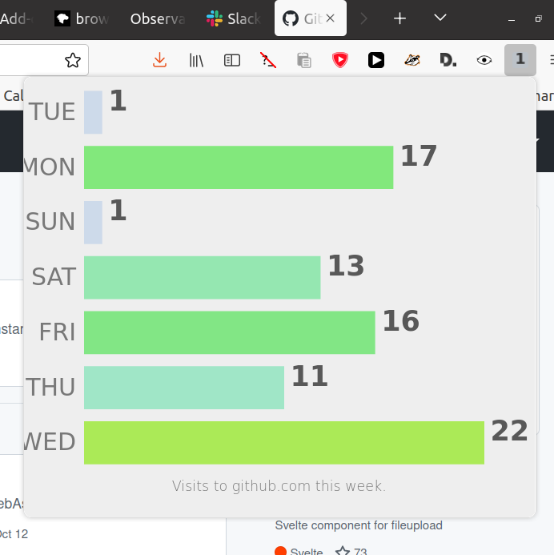

# Back Again?

This is a browser extension that tells you how many times you've visited the page you're on by updating its button. It also tells you how often how've visited the page across all time when you mouseover the button.

If you just want to use it on Chrome, [go here](https://extension.google.com/webstore/detail/backagain/kjponlihgeoeeppkmclokpbijdomjmfg) and ignore the rest of this.

## Installing the extension from source

### Firefox

TODO

### Chrome

1. Go to Extensions in Chrome.
2. Check "Developer mode".
3. Hit "Load unpacked extension" and point it to the extension directory in this repo.

## Structure

__background.js__ creates and inits the Reporter. Potentially, it may someday also set up non-reporter-related event listeners.

__reporter.js__ responds to page visit and tab activation events by going through visit items from extension.history to count visits for today and all-time, then reports them through the icon and the title (the button tooltip).

__makeicon.js__ has a function that creates the new icon showing the number of visits to the page. It draws text to a canvas context, then passes the data from that context to extension.browserAction.setIcon. It does this instead of using setBadgeText because the badge text only takes up a quarter of the tiny extension button. We want to use as much of it as we can.

__colordesignator.js__ decides what color the button background should be based on the number of visits. It makes the background redder, more saturated, darker, and less transparent the more visits there are.
